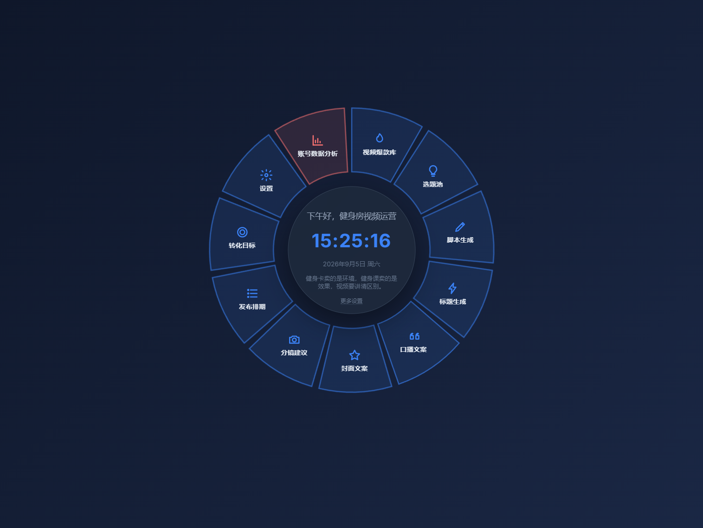
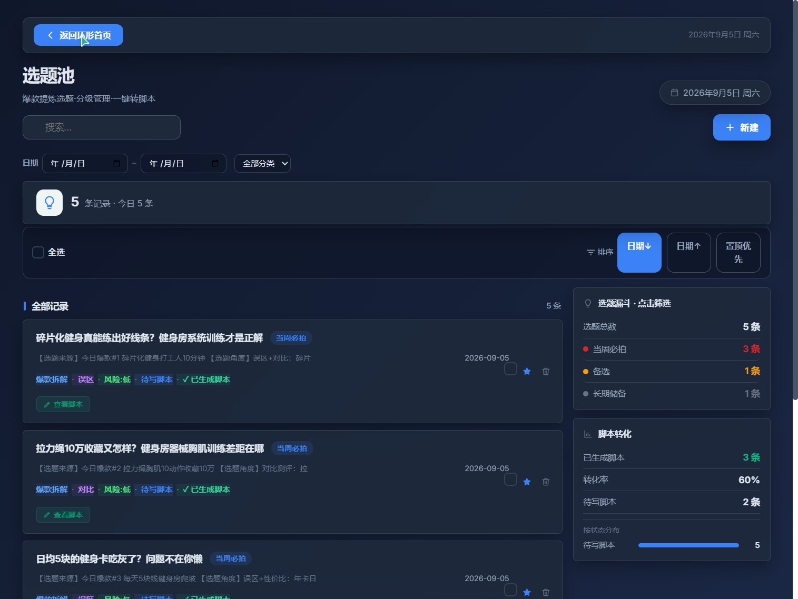
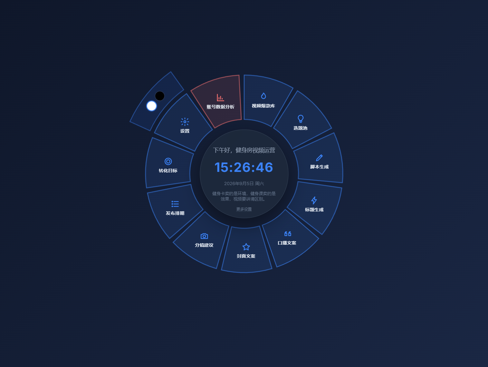
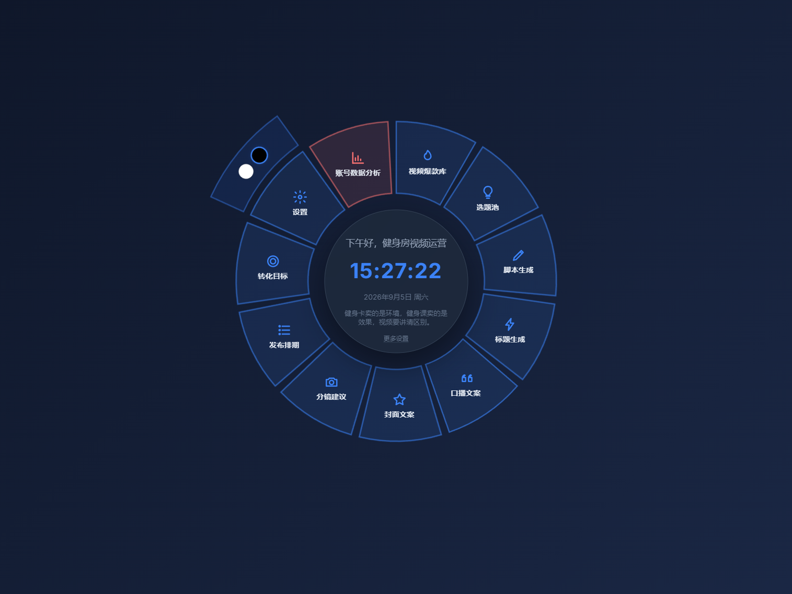

# 健身房视频运营工作台

> 纯前端单文件应用 · 零依赖 · 无需后端 · 本地数据持久化

面向健身房短视频运营团队的一站式工作台，覆盖从选题策划、脚本编写、排期管理到发布复盘的全链路流程。采用**环形径向首页**设计，以 SVG 扇区交互为核心导航方式。

***

## 界面预览

### 环形径向首页

11 个业务模块以 SVG 扇区布局环绕中心时钟卡片，悬浮放大 + 点击展开，一眼掌控全部功能入口。中心卡片实时显示问候语、时钟、日期与每日运营金句。



***

### 选题池模块

爆款提炼选题 → 分级管理 → 一键转脚本。左侧列表展示选题卡片（优先级标签、来源追溯、风险评级、脚本状态），右侧漏斗统计 + 转化率实时监控。



***

### 设置副面板

点击设置主扇区，外侧弧形副面板平滑展开，内含两个纯圆形按钮（白色=浅色，黑色=深色）。副面板跟随主扇区缩放自适应定位，合并热区交互，移出区域自动收起。



***

### 深色模式

内置浅色/深色双主题，CSS 变量驱动全页面同步切换。点击设置扇区展开外侧弧形副面板，一键切换主题，状态持久化到 localStorage。



***

### 设置列表页

中心时钟卡片角落保留「更多设置」入口，点击进入完整业务设置列表页面，与环形首页高频主题切换形成分层设计。


***

## 核心特性

| 特性      | 说明                                         |
| ------- | ------------------------------------------ |
| 环形径向首页  | 11 个业务扇区 + 中心时钟卡片，SVG 路径计算与交互动画            |
| 深色/浅色主题 | CSS 变量驱动全页面主题切换，localStorage 持久化           |
| 零依赖单文件  | 单个 HTML 文件包含全部 HTML/CSS/JS，无需安装、无需联网       |
| 本地数据持久化 | 基于 localStorage，所有数据存储在浏览器本地               |
| 全链路内容管理 | 选题 → 脚本 → 标题 → 配音 → 封面 → 分镜 → 排期 → 发布 → 复盘 |

## 模块一览

| 模块  | 说明              |
| --- | --------------- |
| 爆款库 | 同类爆款拆解，可复用模板    |
| 选题池 | 选题筛选与状态流转，一键转脚本 |
| 脚本库 | 口播脚本编写与管理       |
| 标题库 | 爆款标题模板          |
| 配音库 | 配音文案管理          |
| 封面库 | 封面图片 URL 管理     |
| 分镜库 | 分镜脚本规划          |
| 排期  | 周历排期管理          |
| 发布  | 发布记录与状态追踪       |
| 目标  | 转化目标设定与追踪       |
| 分析  | 平台账号数据分析        |
| 设置  | 主题切换（环形首页内嵌副面板） |

## 快速开始

```bash
# 克隆仓库
git clone https://github.com/asdfghjkl501/gym-video-workbench.git

# 进入目录
cd gym-video-workbench

# 直接用浏览器打开
start workbench-desktop.html    # Windows
open workbench-desktop.html      # macOS
xdg-open workbench-desktop.html  # Linux
```

无需安装任何依赖，无需启动服务器，双击打开即可使用。

## 技术栈

- **HTML5** — 单文件结构，内联全部 CSS 与 JavaScript

- **CSS 变量** — 完整的 Design Token 系统，驱动主题切换

- **SVG** — 环形径向布局，扇区路径计算与交互动画

- **localStorage** — 本地数据持久化，不上传任何服务器

- **Inter** — Google Fonts CDN 引入（仅字体，核心功能离线可用）

## 设计规范

### 配色

| Token            | 浅色模式                     | 深色模式                  | 用途      |
| ---------------- | ------------------------ | --------------------- | ------- |
| `--page-bg`      | `#f7f9fc`                | `#0f172a`             | 页面背景    |
| `--surface-card` | `rgba(255,255,255,0.88)` | `rgba(30,41,59,0.88)` | 卡片表面    |
| `--text`         | `#1f2933`                | `#e2e8f0`             | 主文本     |
| `--accent`       | `#2563eb`                | `#3b82f6`             | 强调色（冷蓝） |
| `--border`       | `#e2e8f0`                | `#334155`             | 边框      |

### 圆角与字体

- 控件 10px · 卡片 12px · 抽屉 16px

- `Inter` 400 / 500 / 600 / 700

## 环形首页交互

- **悬浮** — 鼠标悬停扇区，放大 1.1x 并向外偏移，其余扇区降低透明度

- **点击** — 点击业务扇区，播放按压动画后进入模块展开视图

- **设置扇区** — 点击展开外侧弧形副面板，浅色/深色切换按钮；副面板跟随主扇区缩放

- **中心卡片** — 问候语 + 实时时钟 + 日期 + 每日金句 + 更多设置入口

## 数据存储

所有数据通过 `localStorage` 存储，键名前缀为 `gym-`。清除浏览器数据会导致内容丢失，建议定期通过各模块导出功能备份数据。

## 项目结构

```
gym-video-workbench/
├── workbench-desktop.html    # 主应用文件（单文件，约 3450 行）
├── screenshots/              # 界面截图
│   ├── 01-home-ring-light.png
│   ├── 03-module-topic.png
│   ├── 04-settings-panel.png
│   ├── 05-home-ring-dark.png
│   └── 07-settings-page.png
├── README.md                 # 项目说明
├── LICENSE                   # MIT 开源协议
└── .gitignore                # Git 忽略规则
```

## 浏览器兼容

Chrome 90+ · Edge 90+ · Firefox 88+ · Safari 14+

需启用 JavaScript 与 localStorage。

## 开源协议

[MIT License](./LICENSE)
